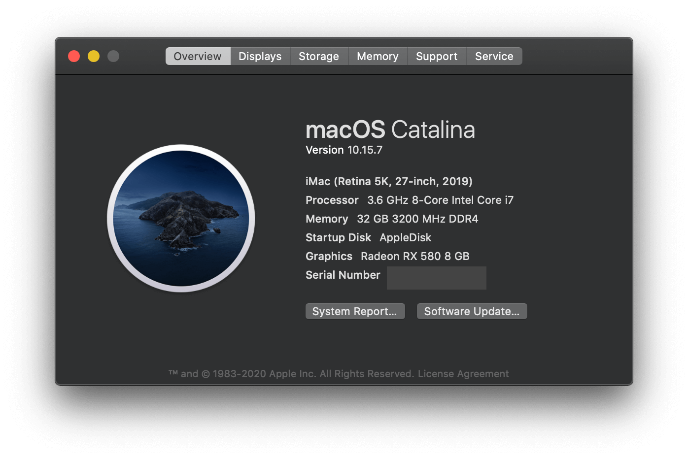

# OpenCore-Gigabyte-Z390M-Gaming
An OpenCore config of hackintosh, about Gigabyte Z390M Gaming.

You can see my change log [here](./doc/changelog.md).
## Computer Configuration
Component | Brank
-|-
CPU | Intel i7 9700K
MotherBoard | Gigabyte Z390M Gaming
Memory | Corsair Vengeance 16G DDR4 3200
Graphic Card | Dataland RX580 2304sp 8G
SSD | Samsung 970evo 500G
Net Card | BCM94360CD（Including BlueTooth）
Power | EVGA 750P2
Fan | JONSBO TW3-240
Case | JONSBO C3-PLUS
Monitor | AOC U2790VQ 27” 4K
Keyboard & Mouse | Magic Keyboard 2 & Mouse 2

## What's working?
- Both iGPU and eGPU are working fine, WITHOUT whatevergreen.kext, thanks to [cattyhouse](https://github.com/cattyhouse/oc-guide), now iGPU can work in best performance.
- **NATIVE NVRAM** is working! I can change my Startup Disk in System Preference. thanks to [acidanthera SSDT-PMC](https://github.com/acidanthera/OpenCorePkg/blob/master/Docs/AcpiSamples/SSDT-PMC.dsl), now `LogoutHook.command` is unnecessary.
- BlueTooth and Wi-Fi are working fine, because of I brought it on purpose.
- USBs are working fine, I patch it with `USBPorts.kext`, thanks to hackintool, you can see [my configuration](./doc/USB.md)
- High Speed USB Charge also working, enable by `USBPower.kext`.
- Sleep is fine, thanks to Gigabyte Z390M Gaming, it really saved my time.

## BIOS Changes
Comes from [tonymacx86](https://www.tonymacx86.com/threads/success-jbarnettes-build-gigabyte-z390-m-gaming-i9-9900k-sapphire-rx-vega-64-8gb-32gb-ram-macos-10-14-3-w-usb3-working.273381/).

- Save & Exit
    - Load Optimized Defaults then make (or confirm) the following settings -- important settings in **bold**:
- M.I.T.
    - Extreme Memory Profile (X.M.P.) → **Profile 1**
- BIOS
    - Windows 8/10 Features → **Other OS**
    - CSM Support → **Disable**
        - Secure Boot will be disabled by default, but good to check
- Peripherals
    - Initial Display Output → PCIe Slot 1. If your discrete graphics card is in Slot 2, change this appropriately.
    - Intel Platform Trust Technology (PTT) → Disabled
    - Thunderbolt(TM) Configuration
        - TBT Vt-d Base Security → **Disabled**
        - Thunderbolt Boot Support → **Disabled**
        - Security Level → **No Security**
    - USB Configuration
        - Legacy USB Support → Enabled
        - XHCI Hand-off → **Enabled**
    - Network Stack Configuration
        - Network Stack → **Disabled**
- Chipset
    - Vt-d → **Disabled**
    - Internal Graphics → **Enabled**
    - DVMT Pre-Alloc → 64M
    - DVMT Total Gfx Mem → 256M
    - Audio Controller → **Enabled**
    - Above 4G Decoding → **Enabled**
- Power
    - ErP → Disabled
    - RC6 (Render Standby) → Enabled

## Special Config
- Make sure **GENERATE NEW Serial Number & SmUUID** by yourself.
- USB3.0 is active by kexts/Other/USBPorts.kext. USBInjectALL.kext is unnecessary.
