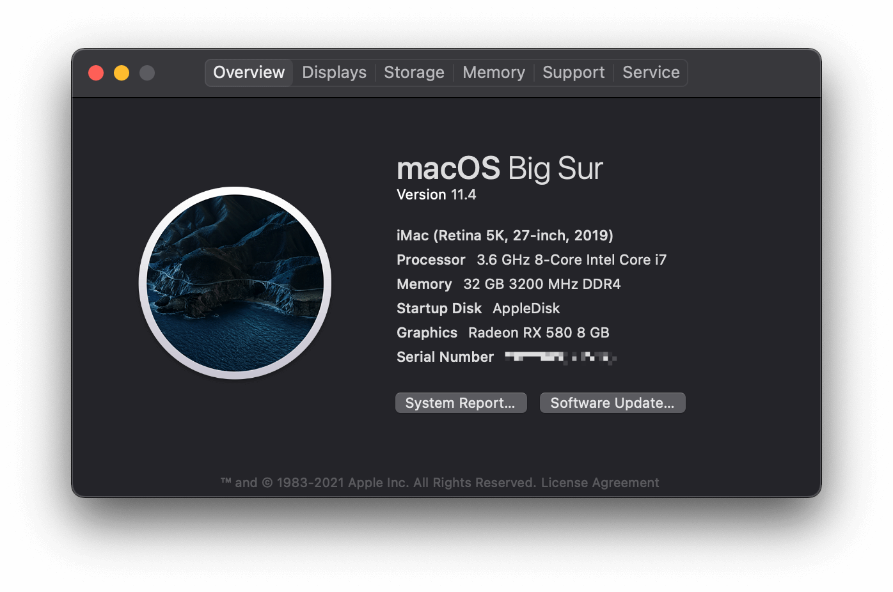

# OpenCore-Gigabyte-Z390M-Gaming
An OpenCore config of hackintosh, about Gigabyte Z390M Gaming.

You can see my change log [here](./doc/changelog.md).
## Computer Configuration
Component | Brank
-|-
CPU | Intel i7 9700K
MotherBoard | Gigabyte Z390M Gaming
Memory | Corsair Vengeance 16G DDR4 3200 x 2
Graphic Card | Dataland RX580 2304sp 8G
SSD | Samsung 970evo 500G
Net Card | BCM94360CD（Including BlueTooth）
Power | EVGA 750P2
Fan | JONSBO TW3-240
Case | JONSBO C3-PLUS
Monitor | AOC U2790VQ 27” 4K
Keyboard & Mouse | Magic Keyboard 2 & Mouse 2

## What's working?
- Both iGPU and eGPU are working fine.
- **NATIVE NVRAM** is working! I can change my Startup Disk in System Preference. thanks to [acidanthera SSDT-PMC](https://github.com/acidanthera/OpenCorePkg/blob/master/Docs/AcpiSamples/SSDT-PMC.dsl), now `LogoutHook.command` is unnecessary.
- BlueTooth and Wi-Fi are working fine, because of I brought it on purpose.
- USBs are working fine, I patch it with `USBPorts.kext`, thanks to hackintool, you can see [my configuration](./doc/USB.md)
- High Speed USB Charge also working, enable by `USBPower.kext`.
- Sleep is fine, thanks to Gigabyte Z390M Gaming, it really saved my time.

## BIOS Changes
MAKE SURE YOU HAVE UPDATED TO VERSION F9M! NOW CFG-LOCK CAN BE DISABLE MANUALLY!

1. Save & Exit
    - Load Optimized Defaults then make (or confirm) the following settings -- important settings in **bold**:
2. Setting modify
- Tweaker
    - Advanced CPU Settings
      - VT-d → **Disabled**
    - Extreme Memory Profile(X.M.P.) → Profile 1
- Settings
    - Platform Power
        - Platform Power Management → **Disabled**
        - ErP → **Disabled**
    - CSM Support → **Disable**
        - Secure Boot will be disabled by default, but good to check
    - IO Ports
        - Initial Display Output → PCIe Slot 1. (If your discrete graphics card is in Slot 2, change this appropriately.)
        - Internal Graphics → **Enabled**
        - Above 4G Decoding → Enabled
        - Resize BAR Support → Disabled
        - Super IO Configuration
            - Serial Port → Disabled
        - USB Configuration
            - XHCI Hand-off → **Enabled**
            - Legacy USB Support → Enabled
            - USB Mass Storage Driver Support → Enabled
            - Port 60/64 Emulation → Disabled
        - Network Stack Configuration
            - Network Stack → Disabled
     - Miscellaneous
        - Intel Platform Trust Technology(PTT) → **Disabled**
        - Software Guard Extensions(SGX) → **Disabled**
- Boot
    - CFG Lock → Disabled (This is VERY VERY IMPORTANT)
    - Windows 8/10 Features → **Other OS**
    - CSM Support → Disable
    - Secure Boot → Disable
## Tips
- USB3.0 is active by kexts/Other/USBPorts.kext. USBInjectALL.kext is unnecessary.
